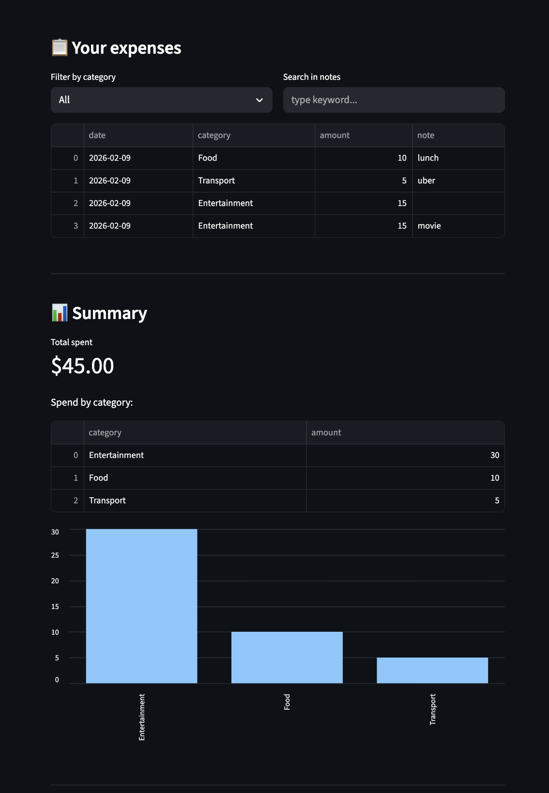

# 💸 Student Expense Tracker (Streamlit)

A simple web app to add expenses, store them in a CSV file, and view spending summaries by category.

---

## 🚀 Features
- Add expenses (date, category, amount, optional note)
- Saves data to `data/expenses.csv` (data persists between runs)
- Filter by category and search notes
- View total spent
- See spending by category using a bar chart

---

## 🛠 Tech Stack
- Python
- Streamlit
- pandas

---

## ▶️ How to Run

1. Install dependencies:

```bash
python3 -m pip install -r requirements.txt
```

2. Run the app:

```bash
python3 -m streamlit run app.py
```

3. Open the local URL shown in Terminal (usually http://localhost:8501)

---

## 📸 Sample Output



---

## 📂 Project Structure

- `app.py` — Streamlit application
- `data/expenses.csv` — saved expense data
- `assets/` — screenshots for README
- `requirements.txt` — dependencies
